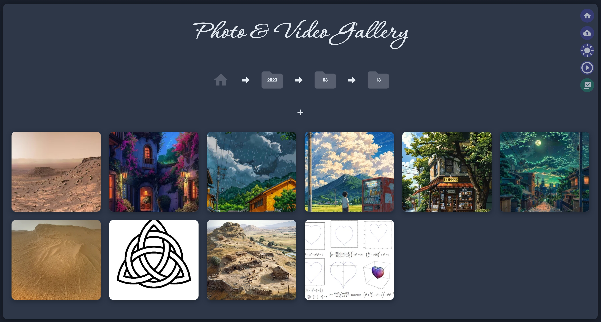

# 📸 Photo & Video Gallery


A self-hosted, web-based gallery application for browsing and managing a personal library of photos and videos. Built with a Python Flask backend and a modern vanilla JavaScript frontend.


Demo: http://143.47.246.212:8080 


---

## 🔑 Key Features

- **Folder-Based Browsing**: Navigate your media library through a familiar folder structure (e.g., `Year > Month > Day`). Upload files with drag-n-drop or using upload button into any folder.
- **Wide Format Support**: Handles common image (`.jpg`, `.png`, `.webp`), video (`.mp4`, `.mov`), and various camera RAW formats (`.nef`, `.cr2`, `.dng`, etc.).
- **HEIC Support**: Automatically converts Apple's `.heic` format for web viewing on the fly.
- **Automatic Thumbnail Generation**: Fast-loading `.webp` thumbnails are created automatically for all media types.
- **Interactive Lightbox**: View media in a fullscreen overlay with smooth zoom, pan, and keyboard navigation.
- **Recursive Slideshow**: Start a slideshow from any folder to view all media within it and its subfolders. Root-level files are intelligently played first.

### 🗑️ Full Trash System

- Move individual files, multiple files, or entire folders to a dedicated Trash folder.
- Restore selected items, multiple items, or all items from the trash to their original locations.
- Permanently delete selected items or empty the entire trash.

### 🧰 Multi-Select

- Select multiple files in the gallery view to perform batch actions (delete, restore, or permanent delete).

### 🗂️ File & Folder Management

- Upload files directly to the current folder via a file selector or drag-and-drop.
- Create new subfolders.

### 🎨 Customizable Theme

- Toggle between a sleek dark mode and a clean light mode.

---

## ⚙️ Technology Stack

- **Backend**: Python 3, Flask  
- **Image/Video Processing**: Pillow, OpenCV, rawpy, pillow-heif  
- **Frontend**: HTML5, CSS3, Vanilla JavaScript (ES6 Modules)  
- **Styling**: Tailwind CSS (via CDN for simplicity)  

---

## 🛠️ Setup and Installation

Follow these steps to get the gallery running on your local machine.

### 1. Prerequisites

- Python 3.7+
- `pip` (Python package installer)
- `openssl` (for generating SSL certificates)

### 2. Backend Setup

**Clone the Repository:**

```bash
git https://github.com/aa3025/photogallery
cd photogallery
````

**Create `requirements.txt`:**

```text
Flask
Pillow
rawpy
opencv-python
numpy
imageio
pillow-heif
```

**Install Dependencies:**

```bash
pip3 install -r requirements.txt
```

If you have trouble installing opencv-python, you can just disable the ``import cv2`` line in the beginning of ``server.py`` (it is only needed for video thumbnails)


**Configure `server.py`:**

```python
######## YOUR SETUP #############

PORT = 8080  # The port you want the server to run on
GALLERY = '/path/to/your/photos'  # Set the ABSOLUTE path to your photo library

#################################
```

**(Optional) Set Up SSL (for HTTPS):**

Generate a self-signed certificate:

```bash
openssl req -x509 -newkey rsa:4096 -nodes -out cert.pem -keyout key.pem -days 365
```

> Press `Enter` to accept the defaults for all prompts.

To run without HTTPS, open `server.py`, find the last line, and **comment out** the `ssl_context` part.

---

### 3. Frontend Setup

Folder named `static` in your project root contains all frontend files.

```
/photogallery
|-- server.py
|-- cert.pem
|-- key.pem
|-- requirements.txt
|-- /static
    |-- index.html
    |-- main.js
    |-- styles.css
    |-- api.js
    |-- ... (other .js files)
```

---

### 4. Running the Application

In your terminal, from the project root:

```bash
python3 server.py
```

The server will perform a one-time scan to index your folders.

Once running, open your browser and visit:

```
http://localhost:8080
```

(there is also an option to serve via https://, see last line of `server.py` file)

---

## 🧪 API Endpoints

| Method   | Endpoint                      | Description                                      |
| -------- | ----------------------------- | ------------------------------------------------ |
| `GET`    | `/api/folders/<path>`         | Gets subfolders and media files for a given path |
| `GET`    | `/api/recursive_media/<path>` | Gets all media files recursively from a path     |
| `GET`    | `/api/media/<path>`           | Serves a specific media file (RAW/HEIC to WEBP)  |
| `GET`    | `/api/thumbnail/<path>`       | Serves a generated thumbnail for a media file    |
| `POST`   | `/api/move_to_trash`          | Moves a file to the trash                        |
| `POST`   | `/api/restore_file`           | Restores a single file from the trash            |
| `DELETE` | `/api/delete_file_forever`    | Permanently deletes a file from the trash        |
| `POST`   | `/api/delete_multiple`        | Deletes or permanently deletes multiple files    |
| `POST`   | `/api/restore_multiple`       | Restores multiple files from trash               |
| `POST`   | `/api/upload_file`            | Handles file uploads                             |
| `POST`   | `/api/create_folder`          | Creates a new folder                             |
| `GET`    | `/api/trash_content`          | Gets the list of all files in the trash          |
| `POST`   | `/api/empty_trash`            | Permanently deletes all items in the trash       |
| `POST`   | `/api/restore_all`            | Restores all items from the trash                |


---

Created with the help of Google Gemini 2.5 Flash (it was a struggle :)
